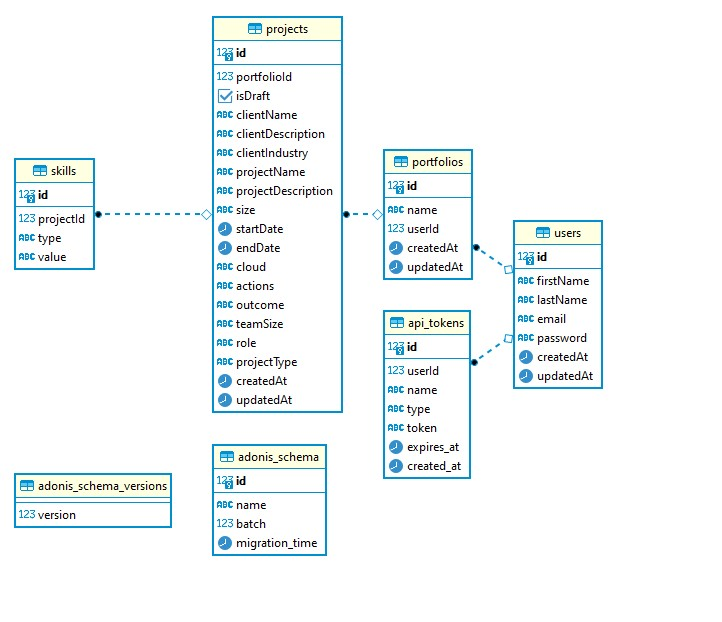
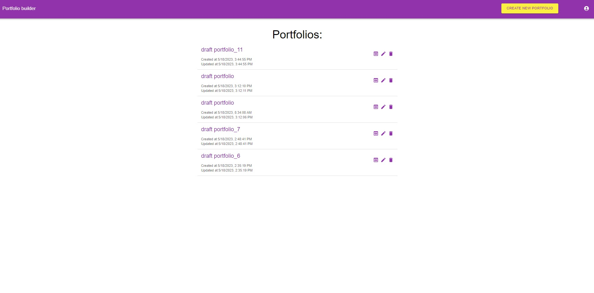
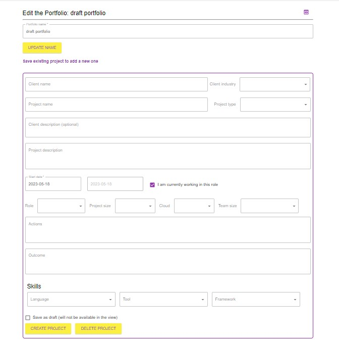
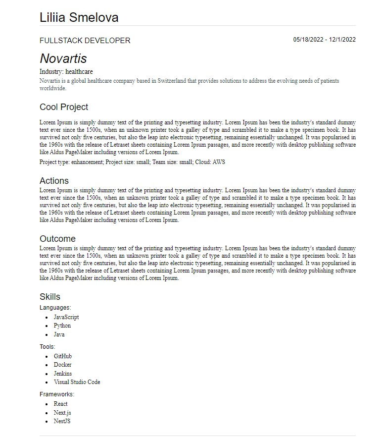

# Portfolio Builder Application

This is a portfolio builder application that uses Adonis for API and React (Next.js) for the frontend. The application allows users to create, store, and delete their portfolios. It also provides a mode for viewing individual portfolios.

## Technologies Used

- Adonis (API)
- React (Next.js) (Frontend)

## Features

- Create portfolios
- Store portfolios
- Delete portfolios
- View individual portfolios
- Authentication using tokens

Database schema

UI:

